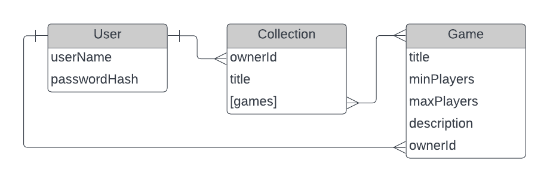

# Game Tracker

Game Tracker is a quick way to make a digital copy of your boardgame collection (or whatever kinds of games you like, I won't tell). Accessible anywhere you go, this digital library of games is essential when planning boardgame nights and is an easy way to show off your collection to friends.

# Technologies

Game Tracker's backend is built with the following tools:

- MongoDB (mongoose)
- Express
- Node
- Passport
- jsonwebtoken

# Entity Relationships

Game Tracker's database relies on three models User, Collection, and Game.  
- User stores login information.  
- Collection has an owner field that points to a user and an array of references to Game documents. Many collections can belong to the same owner.  
- Game stores the details of a game, as well as the User that created it. In version 2, game ownership could be established through collection properties, but version 3 is expected to allow users to browse others' games and add them to collections so Game includes the ownerId reference to establish permissions later in development.  

# Routes

| Name              | Path                | Verb   | Purpose                                                                                                                                                    |
| :---------------- | :------------------ | :----- | :--------------------------------------------------------------------------------------------------------------------------------------------------------- |
| Sign up           | /sign-up            | POST   | Attempt to create user profile                                                                                                                             |
| Log in            | /sign-in            | POST   | Pass user credentials to receive authentication token                                                                                                      |
| Create game       | /games              | POST   | Create a new game attached to sign-in user and any collections listed in request body                                                                      |
| Index games       | /games              | GET    | List all games. Include query key `collection` to filter results                                                                                           |
| Show game         | /games/:id          | GET    | Get details of one game                                                                                                                                    |
| Update game       | /games/:id          | PATCH  | Change details of one game. Request must include auth token of game's owner                                                                                |
| Delete game       | /games/:id          | DELETE | Delete one game. Request must include auth token of game's owner                                                                                           |
| Index collections | /collections        | GET    | Get all collections of logged-in user                                                                                                                      |
| Create collection | /collections        | POST   | Create a new collection for logged-in user                                                                                                                 |
| Reset             | /admin/reset-to-dev | PUT    | Resets database to known development condition. It is only authorized for the Admin user, but it's should probably still be removed from deployed servers. |
|                   |                     |        |                                                                                                                                                            |

# Next Steps

Game Tracker is between it's MVP and Version 2 milestones. The user stories below lay out the future plans for Game Tracker, and are organized roughly in order of priority.

## Version 2

- As a user I need to be able to share a read-only link to my collections so I can show my collection to friends
- As a user I need to be able to access read-only links without signing in so that my friends don't need an account to see my collection

## Version 3

- As a user I need to be able to search a list of pre-defined games because I don't want to define all my games myself
- As a user I need to be able to add cover pictures to games
- As a user I need to be able to add session notes to each game
